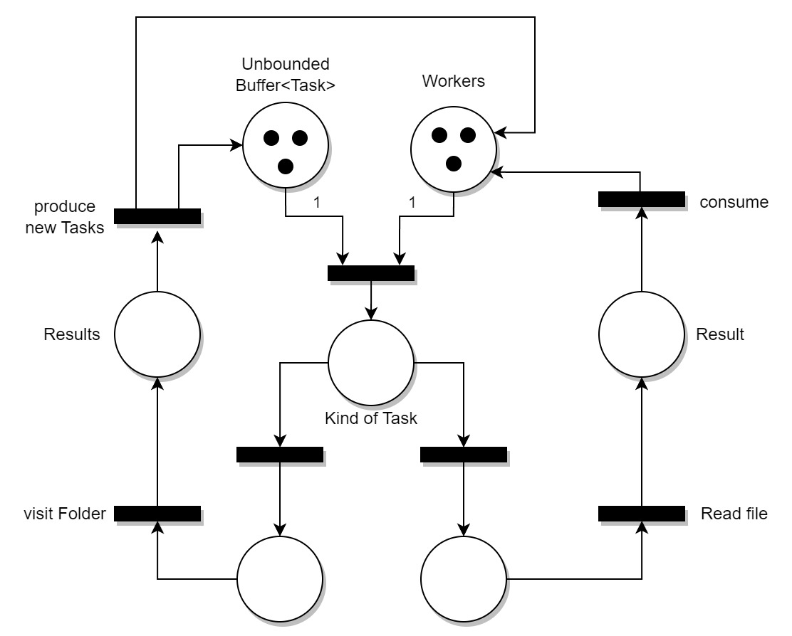
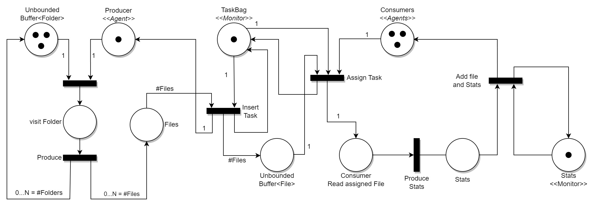
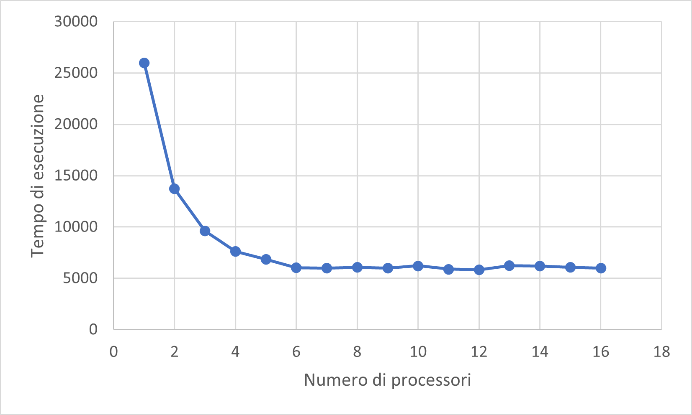
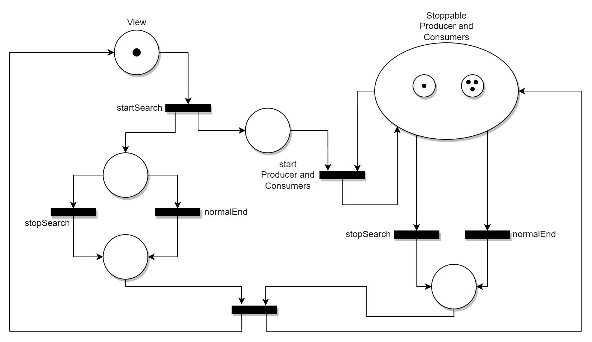

<!--- For math in pdf conversion
<script type="text/javascript" src="http://cdn.mathjax.org/mathjax/latest/MathJax.js?config=TeX-AMS-MML_HTMLorMML"></script>
<script type="text/x-mathjax-config">
  MathJax.Hub.Config({ tex2jax: {inlineMath: [['$', '$']]}, messageStyle: "none" });
</script>
-->
<!--- For table alignment and bord
<style>
table {
  margin: auto;
  width: auto;
  border: 1px solid black;
}
</style>
-->

# PCD Assignment 01

> Desclaimer: la prima parte di questo report è presente perché la soluzione adottata non scalava in performance con il JDK8.
>
> I test sono stati eseguiti con un processore 6 core, 12 Thread (`Runtime.getRuntime().availableProcessors() == 12`)


## Architettura per la lettura da file multi-threaded

### Produttore Consumatori


Il primo approccio per la lettura da file è stata un'architettura produttore (1) e consumatori (n = #PROCESSORI) come componenti attivi: gli agenti condividono un Buffer di file da analizzare (*Monitor*).

- *Produttore*: inizializzato con la cartella (o più di una) da esplorare. Mantiene internamente una lista di cartelle da esplorare (*folders*) e, ad ogni iterazione, ne prende una. Data una cartella, ne controlla il contenuto e, per ogni elemento:
    - se è una *cartella* viene aggiunta a folders
    - se è un *file* viene aggiunto al Monitor

- *Consumatori*: competono sul monitor per ricevere file da analizzare, consumandoli.

A fronte dei test eseguiti, il singolo produttore è più rapido ad esplorare ricorsivamente le cartelle, rispetto al consumo dei file da parte dei consumatori.

[Implementazione produttore-consumatore](../part-01/src/pcd/concurrent_reading/producer_consumer/)

#### Performance

Per poter apprezzare i risultati, il codice è stato eseguito analizzando tutti i file che venivano trovati, partendo da una cartella con un numero sufficiente di elementi.

> I test sono stati ripetuti sempre sulla stessa directory.

##### JDK8 

Il JDK8 (*corretto-1.8.0_362*) non ha permesso di scalare notevolmente tramite la soluzione adottata.

$$ S \approx 1.4 $$

<div align="center">

| #Consumers | Time (ms) |
|:----------:|:---------:|
|      1     |   55892   |
|      2     |   49762   |
|      3     |   46678   |
|      4     |   48528   |
|     ...    |    ...    |
|     12     |   39397   |
|     13     |   39957   |

</div>

[VisualVM produttore consumatore JDK8](./img/architettura/prod-cons/visualvm-producer-consumer-jdk8.jpg)

##### JDK17

Il JDK17 (*Oracle OpenJDK version 17.0.2*) invece, ha permesso di scalare notevolmente tramite la soluzione adottata.

$$ S \approx 5.5  $$

<div align="center">

| #Consumers | Time (ms) |
|:----------:|:---------:|
|      1     |   58185   |
|      2     |   30982   |
|      3     |   21605   |
|      4     |   17010   |
|      5     |   14541   |
|      6     |   12878   |
|      7     |   11806   |
|     ...    |    ...    |
|     12     |   11328   |
|     13     |   10698   |

</div>

[Grafico speed up Produttore Consumatori](./img/architettura/prod-cons/prod-cons-grafico.png)

[VisualVM produttore consumatore JDK17](./img/architettura/prod-cons/visualvm-producer-consumer-jdk17.jpg)


### Worker ricorsivi



Il secondo approccio ideato per leggere da file mediante più Thread, è stato quello di sfruttare N *Worker*, un'unica componente attiva replicata. Tutti condividono un monitor (*TaskBag*) dove sono presenti i compiti da svolgere. A differenza dell'approccio precedente, ora sono gli worker stessi ad aggiungere nuovi Task, se necessario.

Questa idea nasce dal fatto che, se gli worker che consumano file sono più veloci di chi li produce, rimarrebbero in attesa.
Potendo far operare un worker sia come producer, che come consumer, questo permette di far svolgere i task a chiunque sia in attesa.

Il ciclo di vita del worker inizia richiedendo un task al monitor e, se disponibile, lo elabora:

- Se il Task ricevuto è un file (FileAnalyzerTask): lo analizza
- Se il Task ricevuto è una cartella (FolderAnalyzerTask), allora esplora la cartella ed inserisce tanti FileAnalyzerTask e FolderAnalyzerTask in relazione ai nodi che trova.

[Implementazione worker](../part-01/src/pcd/concurrent_reading/recursive_worker/)

#### Performance

Anche in questo caso il JDK8 si rivela peggiore del JDK17 in termini di scalabilità in lettura, al crescere del numero dei Thread.

##### JDK8 

$$ S \approx 1.1 $$

<div align="center">

|   #Worker  | Time (ms) |
|:----------:|:---------:|
|      1     |   43190   |
|      2     |   45411   |
|      3     |   46572   |
|      4     |    ...    |
|     12     |   40136   |

</div>

[VisualVM worker JDK8](./img/architettura/worker/visualvm-worker-jdk8.jpg)

##### JDK17


$$ S \approx 5.5 $$

<div align="center">

| #Workers | Time (ms) |
|:--------:|:---------:|
|     1    |   59429   |
|     2    |   30435   |
|     3    |   20950   |
|     4    |   15739   |
|     5    |   13182   |
|     6    |   11544   |
|    ...   |    ...    |
|    12    |   11485   |
|    13    |   10866   |


</div>

[Grafico speed up Workers](./img/architettura/worker/worker-grafico.png)

[VisualVM worker JDK17](./img/architettura/worker/visualvm-worker-jdk8.jpg)


## Part 01

A fronte dell'analisi sulla lettura dei file svolta in precedenza, è stata adottata la soluzione **Produttore - Consumatori**, dato che le prestazioni di velocità erano simili.

Il diagramma proposto in precedenza è stato dettagliato ulteriormente, in modo da tenere conto del flusso di controllo del singolo *Produttore* ed è stato aggiunto un *Monitor* per raccogliere le statistiche dei files.

Per la lettura del grafico si può partire da sinistra verso destra:

- La parte a sinistra è il ciclo di vita del **Producer** (Agente) che prende una cartella e la visita:
  - per ogni cartella che trova, la inserisce nel buffer delle cartelle da visitare.
  - per ogni file che trova, lo inserisce nel buffer di file da analizzare, ma deve attendere che il monitor sia disponibile.
  - **Nota:** il buffer delle cartelle è interno al Producer, mentre il buffer dei file no, quindi quest'ultimo deve attendere il monitor per poter aggiungere i files e poter analizzare una nuova cartella.

- La parte centrale è quella relativa alla **TaskBag** (Monitor) ed entrambe le tipologie di Agenti competono su essa:
  - Il Producer cerca di aggiungere nuovi Task.
  - I Consumers richiedono nuovi Task da svolgere.

- La parte a destra rappresenta il ciclo di vita dei **Consumers** (Agenti). Ogni consumer sfrutta 2 Monitor:
  - La TaskBag per ricevere il nuovo Task da svolgere che, una volta ricevuto, viene processato
  - Il Monitor delle statistiche, dove vengono inserire queste ultime, un volta calcolate.



### Performance

Come proposto in precedenza, anche in questo caso è presente uno *Speed Up* da tenere in considerazione.

Tenendo in considerazione anche l'*Efficienza*, un buon numero di Thread è 6.

$$
S = \frac{T_1}{T_N} \Rightarrow \frac{25.991}{6.019} \approx 4.32
\qquad \Rightarrow \qquad
E = \frac{S}{P} \Rightarrow \frac{4.32}{6} \approx 0.72
$$

Al contrario, aumentando il numero di Thread fino a 12, dove possiamo osservare uno *Speed Up* leggermente più alto, riduciamo di molto l'*Efficienza*.

$$
S = \frac{25.991}{5.834} \approx 4.46
\qquad \Rightarrow \qquad
E = \frac{4.46}{12} \approx 0.37
$$

<div align="center">

| #Consumers | Time (ms) |
|:----------:|:---------:|
|      1     |   25991   |
|      2     |   13732   |
|      3     |    9608   |
|      4     |    7624   |
|      5     |    6855   |
|      6     |    6019   |
|     ...    |    ...    |
|     12     |    5834   |
|     13     |    6214   |

</div>



### JPF

Il software è stato notevolmente semplificato, senza intaccare la logica operativa. Durante il model checking sono stati impiegati 3 Thread per i consumers.

Il task svolto dai consumers è quello di contare la lunghezza della stringa data in input e passarla al monitor, che ne tiene la somma totale.

Per simulare il comportamento del fileSystem è stata utilizzata una mappa da stringhe (nome cartella) a lista di stringhe (lista di possibili file o altre cartelle). Una stringa è considerata cartella se è contenuta come chiave nella mappa.

```java
Map<String, List<String>> fileSystem;
```

La struttura di file system utilizzato durante il model checking è la seguente:

```fileSystem
folder1
├── file1
├── file2
└── folder2
    ├── file3
    └── folder3
```

### TLA+ PlusCal

Il modello del design è stato realizzato partendo dall'architettura *Produttore-Consumatore* fornita, considerando un buffer illimitato.

Il singolo *Producer* mantiene interno un buffer di file visitare, li scorre ed li inserisce nella *TaskBag*, il monitor condiviso. Una volta terminati i file da visitare, il *Producer* termina.

I *Consumers* competono per riceve i task da svolgere, rimanendo in attesa nel caso non ce ne siano. Una volta ricevuto un task, lo svolgono ed aggiornano il risultato finale.

Un *Flag*, che aggiorna il *Producer* una volta terminato il suo compito, permette di sbloccare i *Consumers* in attesa, rendendo possibile la terminazione di tutti i processi.

È controllata l'**invariante** che, alla terminazione di tutti i processi, il risultato finale sia corretto.

Inoltre, è garantita la *proprietà* che il *Producer* termini prima di qualsiasi *Consumer*.

$$
  \Box(\exists \texttt{ consumer done} \Rightarrow \texttt{producer done})
$$

Un'altra *proprietà* garantita è che, se sono terminati tutti i *Consumers*, allora non ci saranno più task da svolgere.

$$
  \Box(\forall \texttt{ consumers done} \Rightarrow \texttt{TaskBag is Empty})
$$


## Part 02

La seconda parte è stata realizzata estendendo la prima, permettendo all'architettura *Produttore-Consumatori* di essere interrotta in qualsiasi momento.

Per farlo è stato introdotto un *Flag* di stop condiviso, in modo da interrompere la ricerca dei files.

Prima di eseguire una nuova ricerca, è necessario terminare  la precedente oppure attendere che sia terminata.



### JPF

La soluzione adottata per JPF è stata semplificata ulteriormente, in modo da rendere fattibile il model checking.

Il funzionamento generale è stato mantenuto, enfatizzando che la *GUI* possa richiedere di terminare la ricerca in qualsiasi momento.

Questo approccio genera uno esito non deterministico, infatti ciò che si è andato a verificare è che lo stato finale sia minore o uguale a quello atteso.

### TLA+ PlusCal

La soluzione proposta per verificare la correttezza del modello è partita da quella precedente.

È stato introdotto un Processo che ferma l'esecuzione del sistema, in modo da simulare l'azione della GUI.

L'**invariante** sul risultato finale viene modificata, infatti non è possibile prevedere l'esito e il risultato finale è inferiore o uguale a quello atteso.

Inoltre, è stata aggiunta un'ulteriore **invariante**, per verificare che il risultato finale non sia più modificato dopo che il sistema è stato fermato.

Le **proprietà** viste in precedenza sono mantenute.
