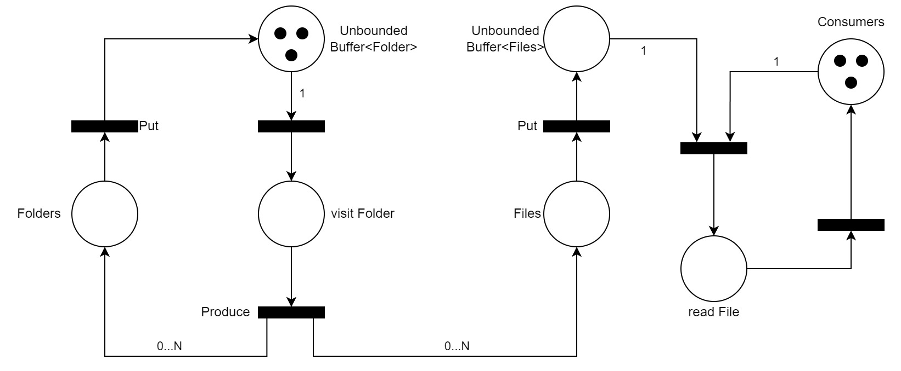

# PCD Assignment 01

> Desclaimer: la prima parte di questo report è presente perché la soluzione adottata non scalava in performance con il JDK8.

## Architettura per la lettura da file multi-threaded

### Produttore Consumatori

Il primo approccio per la lettura da file è stata un'architettura produttore (1) e consumatori (n = #PROCESSORI) come componenti attivi: gli agenti condividono un Buffer di file da analizzare (*Monitor*).

- *Produttore*: inizializzato con la cartella (o più di una) da esplorare. Mantiene internamente una lista di cartelle da esplorare (*folders*) e, ad ogni iterazione, ne prende una. Data una cartella, ne controlla il contenuto e, per ogni elemento:
    - se è una *cartella* viene aggiunta a folders
    - se è un *file* viene aggiunto al Monitor

- *Consumatori*: competono sul monitor per ricevere file da analizzare, consumandoli.

A fronte dei test eseguiti, il singolo produttore è più rapido ad esplorare ricorsivamente le cartelle, rispetto al consumo dei file da parte dei consumatori.

[Architettura produttore-consumatore](../part-01/src/pcd/concurrent_reading/producer_consumer/)

### Worker ricorsivi

