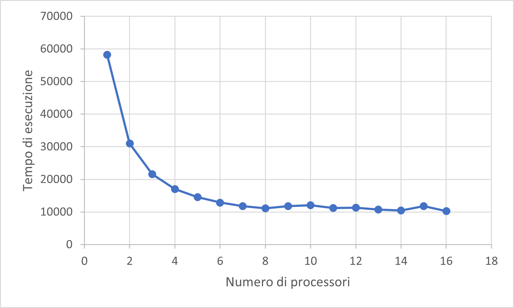

<!--- For math in pdf conversion

-->

# PCD Assignment 01

> Desclaimer: la prima parte di questo report è presente perché la soluzione adottata non scalava in performance con il JDK8.
>
> I test sono stati eseguiti con un processore 6 core, 12 Thread (`Runtime.getRuntime().availableProcessors() == 12`)

## Architettura per la lettura da file multi-threaded

### Produttore Consumatori

Il primo approccio per la lettura da file è stata un'architettura produttore (1) e consumatori (n = #PROCESSORI) come componenti attivi: gli agenti condividono un Buffer di file da analizzare (*Monitor*).

- *Produttore*: inizializzato con la cartella (o più di una) da esplorare. Mantiene internamente una lista di cartelle da esplorare (*folders*) e, ad ogni iterazione, ne prende una. Data una cartella, ne controlla il contenuto e, per ogni elemento:
    - se è una *cartella* viene aggiunta a folders
    - se è un *file* viene aggiunto al Monitor

- *Consumatori*: competono sul monitor per ricevere file da analizzare, consumandoli.

A fronte dei test eseguiti, il singolo produttore è più rapido ad esplorare ricorsivamente le cartelle, rispetto al consumo dei file da parte dei consumatori.

[Implementazione produttore-consumatore](../part-01/src/pcd/concurrent_reading/producer_consumer/)

#### Performance

Per poter apprezzare i risultati, il codice è stato eseguito analizzando tutti i file che venivano trovati, partendo da una cartella con un numero sufficiente di elementi.

> I test sono stati ripetuti sempre sulla stessa directory.

#### JDK8 

Il JDK8 (*corretto-1.8.0_362*) non ha permesso di scalare notevolmente tramite la soluzione adottata, $ S \approx 1.4 $

| #Consumers | Time (ms) |
|:----------:|:---------:|
|      1     |   55892   |
|      2     |   49762   |
|      3     |   46678   |
|      4     |   48528   |
|     ...    |    ...    |
|     12     |   39397   |
|     13     |   39957   |

[VisualVM produttore consumatore JDK8](./img/architettura/prod-cons/visualvm-producer-consumer-jdk8.jpg)

#### JDK17 

Il JDK17 (*Oracle OpenJDK version 17.0.2*) invece, ha permesso di scalare notevolmente tramite la soluzione adottata.

| #Consumers | Time (ms) |
|:----------:|:---------:|
|      1     |   58185   |
|      2     |   30982   |
|      3     |   21605   |
|      4     |   17010   |
|      5     |   14541   |
|      6     |   12878   |
|      7     |   11806   |
|     ...    |    ...    |
|     12     |   11328   |
|     13     |   10698   |

$$ S = \frac{T_1}{T_N} \Rightarrow \frac{58.185}{10.698} \approx 5.5  $$

[VisualVM produttore consumatore JDK17](./img/architettura/prod-cons/visualvm-producer-consumer-jdk17.jpg)

### Worker ricorsivi

